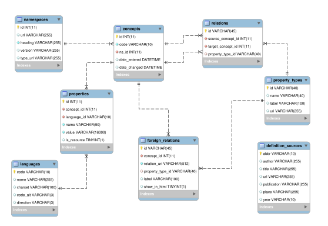

Database
========

Diagram
-------

The following picture depicts the database diagram, which consists of the
tables in the database, the relationships between them and the columns in each
table with its associated type.

   Database Diagram

Backend
-------

The application uses a single database on a MySQL server running on localhost.
Each table has a corresponding class in ``models``, and the rows in the table
are instances of that class.

Given that concepts are divided into categories according to the namespace they
belong to, five subclasses (of ``Concept``) have been defined: ``Term``,
``Theme``, ``Group``, ``SuperGroup`` and ``Inspire Theme``. These subclasses are implemented using  ProxyModels_, meaning that any subclass instance is saved into ``Concept`` database table, and the difference between these is the Model Manager. Each one of these proxies has a different ``ConceptManager`` instance, which allows to query the ``Concept`` database table only for a specific subclass (Proxy).
Also dividing the ``Concept`` in five subclasses helps to easily diferentiate namespace specific operations and to make code more readable.

An important change that has occured as a result of the old database's
remodeling is that the ``value`` column in the ``Property`` table modified its
type from ``TEXT`` to ``VARCHAR(16000)``. The new data type allowed us to index
this column in order to speed up the queries.

.. _ProxyModels: https://docs.djangoproject.com/en/dev/topics/db/models/#proxy-models